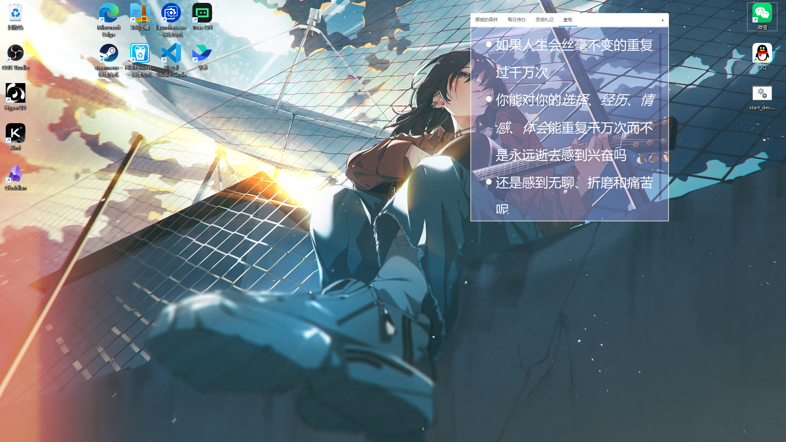
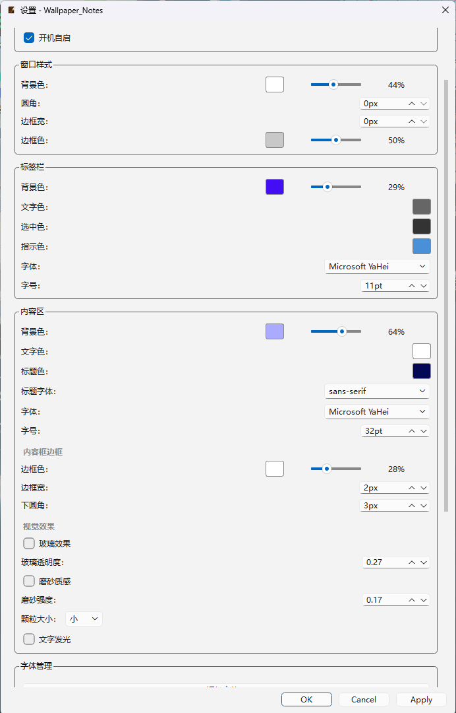

# Wallpaper_Notes 🗒️

> 把便签直接贴在桌面上。不需要打开任何软件就能看到，退到桌面就能写。

让桌面不只是壁纸——更是一个低摩擦的灵感看板。

> **English?** This README is in Chinese because the app is Chinese-first. An English version may come later. The code comments, SKILL.md, and config files are bilingual or English-friendly.

---

## ✨ 功能

**🖼️ 桌面原生显示** — 窗口吸附在桌面层（HWND_BOTTOM），自动隐藏 Alt+Tab，不挡应用

**📑 多便签 + 标签切换** — 一个标签 = 一个 `.md` 文件，直观的标签栏管理

**🖱️ 极低编辑摩擦** — 双击进入编辑模式，**三击**保存退出；Ctrl+Shift+N 一键唤出（快捷键可在设置中修改）（有bug）**Esc**在编辑模式时点击Esc，界面自动退回到桌面

**📝 Markdown 渲染** — 实时预览渲染效果，标题、列表、引用、代码块、行内样式全支持

**🎨 高度可定制** — 窗口样式、字体、颜色、透明度、圆角、边框……所有视觉效果均可通过设置对话框实时调整，所见即所得

**🤖 AI 友好** — 外部程序可直接读写 `notes/` 下的 `.md` 文件；附赠 AI Agent 配套技能（SKILL.md），让 AI 帮你管理便签

**🔤 自定义字体** — 内置字体管理，支持通过 UI 导入任意 `.ttf`/`.otf` 字体，持久保存，重启不丢失

**💎 视觉效果** — 玻璃模糊效果、磨砂质感效果、文字发光、滚动条美化

**🪶 资源占用低** — 后台静默运行，占用极少

---

## 📸 截图


*桌面全貌——便签直接贴在壁纸上，不挡应用窗口，融入桌面环境*

---


*样式配置界面——丰富且高度自定义化的样式选项，所见即所得*

---

## 🚀 快速开始

### 直接下载

> *暂未打包，计划使用 PyInstaller 打包为单文件 exe*

### 源码运行

```bash
# 1. 克隆仓库
git clone https://github.com/yourname/Wallpaper_Notes.git
cd Wallpaper_Notes

# 2. 安装依赖
pip install -r requirements.txt

# 3. 运行
python main.py
```

### 打包 exe

```bash
pip install pyinstaller
pyinstaller main.py --onefile --noconsole --name Wallpaper_Notes --icon=note_app_icon_final.ico
```

---

## 🎮 使用指南

### 基本操作

| 操作 | 方式 |
|------|------|
| 新建便签 | 右键托盘图标 → 新增便签 |
| 编辑便签 | 双击便签内容区域 |
| 保存并退出编辑 | 三击内容区域 / 按 Esc |
| 删除便签 | 右键标签页 → 删除 |
| 重命名便签 | 右键标签页 → 重命名 |
| 切换便签 | 点击标签栏 |
| 唤出窗口 | 默认快捷键 `Ctrl+Shift+N`（可在设置中修改） |
| 设置 | 右键托盘图标 → 设置 |

### 开机自启

打开设置对话框，勾选「开机自启」即可。应用通过 Windows 注册表 `HKCU\Software\Microsoft\Windows\CurrentVersion\Run` 实现。

---

## 🎨 自定义配置

所有预览样式均可在**设置对话框**中实时调整并预览，无需手动编辑 JSON。

### theme.json 参考

如需直接编辑或批量配置：

| 配置节 | 说明 | 关键字段 |
|--------|------|---------|
| `window` | 窗口外观 | `background_color`, `border_radius`, `border_width`, `border_color` |
| `tab_bar` | 标签栏样式 | `background_color`, `text_color`, `font_family`, `font_size`, `height` |
| `content` | 内容区显示 | `font_family`, `font_size`, `text_color`, `heading_color`, `heading_font_family`, `pane_border_*`, `enable_glass`, `enable_glow` |
| `editor` | 编辑模式 | `font_family`, `font_size`, `background_color`, `text_color`, `caret_color` |
| `scrollbar` | 滚动条 | `width`, `handle_color`, `handle_hover_color`, `track_color` |

### config.json 参考

| 配置项 | 说明 |
|--------|------|
| `hotkey.modifiers` | 组合键（Ctrl, Alt, Shift, Win） |
| `hotkey.key` | 触发按键 |
| `behavior.autostart` | 开机自启（推荐通过设置对话框修改） |

---

## 🔤 字体管理

支持通过**设置对话框 → 字体管理**添加自定义字体：

1. 点击「添加字体...」按钮
2. 选择 `.ttf` 或 `.otf` 字体文件
3. 字体自动复制到 `fonts/` 目录，注册到应用
4. 所有字体下拉菜单立刻出现新字体，可直接选用
5. 重启应用后自动加载，字体不丢失

---

## 🤖 AI 集成

### AI Agent 辅助技能

本项目附赠一个 **SKILL.md** 文件，专为 AI Agent（如 OpenClaw、Claude Code 等）设计。

将 SKILL.md 配置为 AI 的 companion skill 后，你只需自然语言指令即可：

```
帮我整理桌面便签，把灵感和待办分开
→ AI 读取 notes/ 目录 → 分析内容 → 自动分类整理
```

```
在桌面新增一句今日诗句
→ AI 写入 notes/金句.md → 窗口自动刷新
```

详情见 [`SKILL.md`](./SKILL.md)。

### 手动集成

```bash
# AI 写入文件，应用自动刷新显示
echo "今天是全新的一天，充满无限可能。" > notes/金句.md
```

支持任何能写入 `.md` 文件的程序或脚本。

---

## 📁 项目结构

```
Wallpaper_Notes/
├── main.py              # 入口
├── app.py               # 应用初始化、设置对话框路由
├── window.py            # 窗口管理、标签栏、编辑/预览切换
├── config.py            # 配置持久化（config.json / theme.json）
├── settings.py          # 设置对话框（UI 实时预览）
├── renderer.py          # Markdown → HTML 渲染
├── notes_manager.py     # 便签文件监控（watchdog）
├── hotkey.py            # 全局快捷键（RegisterHotKey）
├── tray.py              # 系统托盘菜单
├── ui_components.py     # QSS 生成、RoundedPane、ColorButton
├── models.py            # 数据模型
├── theme.json           # 样式默认配置
├── config.json          # 功能默认配置
├── SKILL.md             # AI Agent 配套技能
├── notes/               # 便签数据（.md 文件）
│   ├── 每日待办.md
│   ├── 灵感札记.md
│   ├── 金句.md
│   └── 挪威的森林.md
├── fonts/               # 自定义字体（UI 导入后自动放置）
├── requirements.txt
└── .gitignore
```

---

## 🛠 开发

### 环境要求

- Python 3.10+
- Windows 10/11（依赖 Win32 API）
- PySide6

### 安装依赖

```bash
pip install -r requirements.txt
```
### 注意

该项目有一些bug，虽然不影响主要功能，但托盘设置中的部分参数无法生效


### 项目设计文档

- [`开发者看这里/PRD.md`](./开发者看这里/PRD.md) — 产品需求文档
- [`开发者看这里/架构设计.md`](./开发者看这里/架构设计.md) — 系统架构说明
- [`开发者看这里/开发规范.md`](./开发者看这里/开发规范.md) — 开发标准与约定
- [`开发者看这里/项目功能映射表.md`](./开发者看这里/项目功能映射表.md) — 功能→文件映射
- [`开发者看这里/前端样式文档.md`](./开发者看这里/前端样式文档.md) — 前端样式参考

---

## 📄 许可证

MIT License — 详见 [LICENSE](./LICENSE) 文件。
